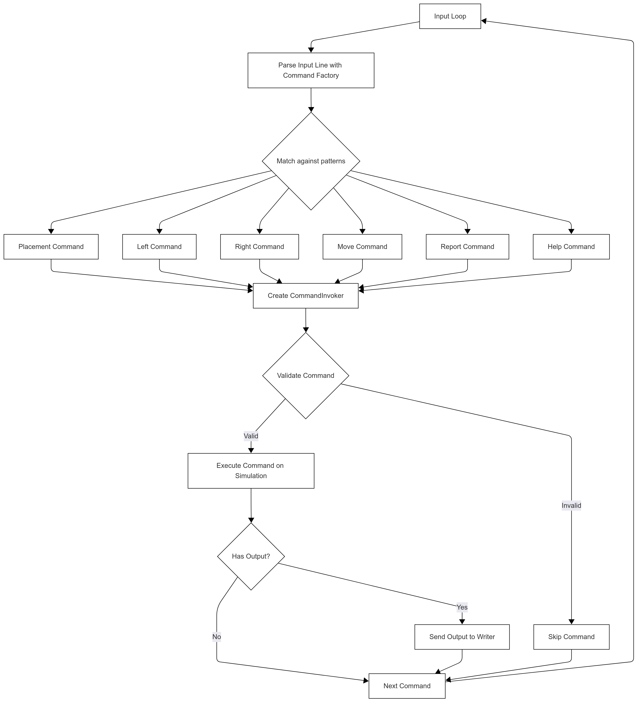

# ToyRobot

## Usage

The Toy Robot Simulator can be run in two ways:

### Interactive Mode (STDIN)

Run the simulator without any arguments to enter commands interactively:

```bash
bin/toy_robot
```

### File Mode

Run the simulator with a file path to process commands from a file:

```bash
bin/toy_robot spec/fixtures/simple.txt
```

## Flow Chart

The following flow chart illustrates the execution flow of the ToyRobot application:



## Design Decisions

### Tooling

- Using Ruby 3.2.3 as that is the version supported by the default Github Actions container image
- Using Rubocop (github ruleset) and Simplecov
- Following the [Better Specs Best Practises](https://www.betterspecs.org/)
- Using ActiveModel standalone for validation (no need for ActiveRecord and we want to follow Clean Architecture by Robert C MArtin)

### Implementation

- Using [Clean Architecture](https://blog.cleancoder.com/uncle-bob/2012/08/13/the-clean-architecture.html) to seperate the concerns and structure the project
- For such a simple CLI interface no CLI gem is required
- The concepts of a robot and table are contained purely on the presentation layer. In the models they will be the Simulation and Grid
- Commands are only responsible for execution, they do validate if it is a valid command
- The Command Invoker is reponsible for verifying if the command result is valid,
  - try the command on a dup object
  - check if it is valid
  - if it is you run on the real object
- Created a contract for the commands [docs/command_pattern.md](docs/command_pattern.md)
- Not using any advance Ruby meta programming as we want to display good OO design using SOLID principles
- Command intepretation and command execution are seperate class
- Using FactoryBot for test data creation to reduce boilerplate and improve test maintainability

### Trade Offs

- No explict interfaces or abstract classes as this is against Ruby standard conventions
- The way that the input with params on the CLI (PLACE 2,3,NORTH) gets parsed and parse in as args made using named params for the command objects not possible (it is used everywhere else)

### Alternatives considered
- Using a state machine for the ToyRobot where each command has an implementation based on what state the robot is in (New, Placed)
- Making an Abstract BaseCommand with methods not implemented. Also using the `inherited` hook to register the child classes

#### Command Contract

See [docs/command_pattern.md](docs/command_pattern.md) for details on the Command Pattern implementation and contract structure.
